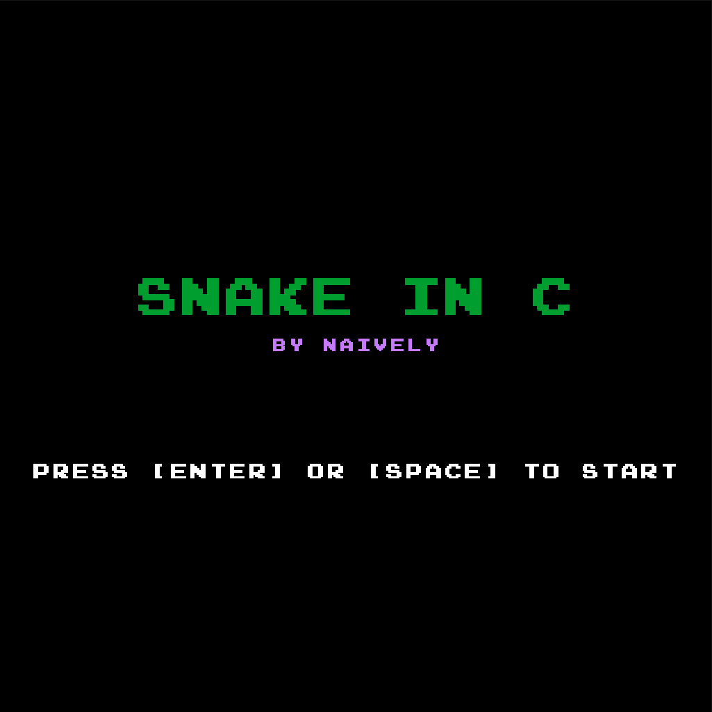

# Snake in C
A project I've started to get more comfortable with programming in C\
Uses Raylib

# How to run
currently you can make it yourself by running:\
'make run' in the root dir

## Notes
This project includes a third party font:
Arcade font is copyright © 1997–2003 Yuji Adachi.
The Arcade font files are not covered by the game's open-source license and remain subject to the author's original terms. See assets/fonts/README-ARCADE.txt.
